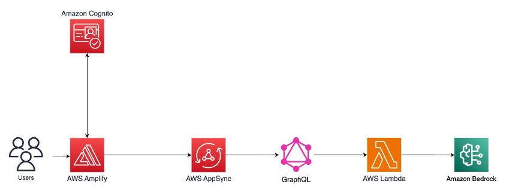
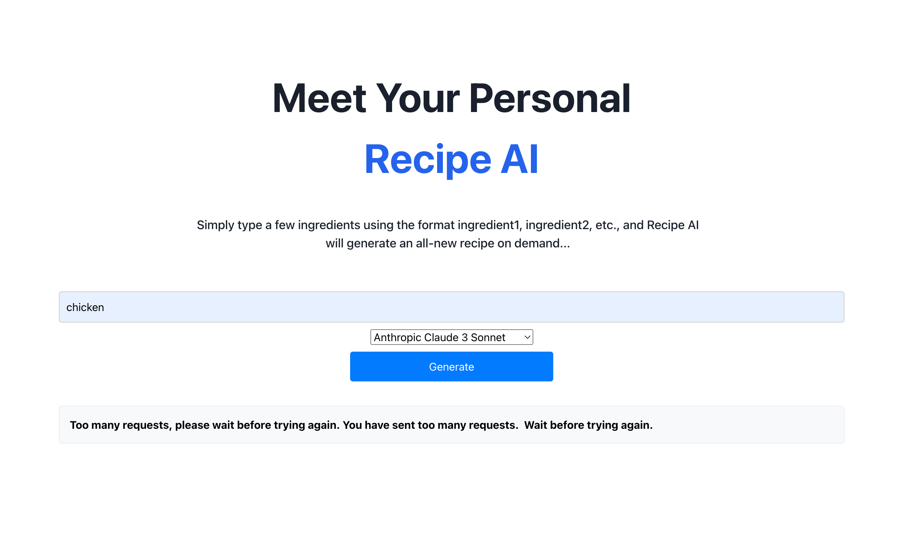

# Build a Serverless Web Application using Generative AI

This repo is based on the [Build a Serverless Web Application using Generative AI](https://aws.amazon.com/getting-started/hands-on/build-serverless-web-app-lambda-amplify-bedrock-cognito-gen-ai/) tutorial that uses AWS Amplify to build a serverless web application powered by Generative AI using Amazon Bedrock and the Claude 3 Sonnet foundation model.

Application Architecture

Install the dependencies with `npm install`. Run the local server with `npm run dev` and spin up the Amplify sandbox with `npx ampx sandbox`.

You might need to run `npx ampx configure profile` to set up the AWS credentials.

The app supports multiple models. To use each one of them, access to them needs to be requested through the Bedrock Model access page.

Here is a table of the price of each model in the US East (N. Virginia) region as of October 2024.

Model | Price per 1000 input tokens | Price per 1000 output tokens
-- | -- | --
Amazon Titan Text G1 Express | $0.0002 | $0.0006
Llama 3 8B Instruct | $0.0003 | $0.0006 
Cohere Command R | $0.0005 | $0.0015
Anthropic Claude 3 Sonnet | $0.003 | $0.015

This is what the UI of the app looks like. Unfortunately, none of the models worked at the time of writing.
Each model returned the ThrottlingException, indicating that they were overloaded.

